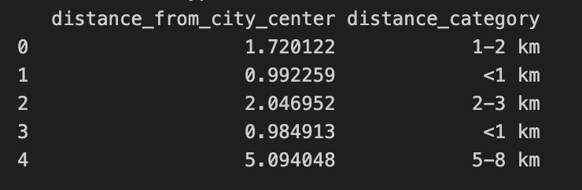

# Business Case: Analysis and Recommendation for Rental Users in Madrid and Barcelona

### Background and Purpose of the Investigation

Barcelona and Madrid are two of the major European tourist hubs, attracting millions of visitors annually. Barcelona alone recorded over 6 million visitors in the most recent year, marking a 5.7% increase from 2023, with an average of 229,531 visitors per day. This compares to 178,289 daily visitors the previous year, as per official data from the Barcelona City Council. Madrid, although receiving fewer tourists, still welcomed an impactful 4.4 million visitors so far this year, according to the Madrid City Council.

This influx of tourists has led to growing discontent among residents in both cities, particularly in central neighborhoods. Locals perceive the surge in tourism as a burden, contributing to rising housing costs, increased shop prices, and congested streets. Much of this frustration is directed at platforms like Airbnb, which are seen as exacerbating the problem.


**Purpose of the Analysis:**
The purpose of this investigation is to provide insights and recommendations for managing rental markets and tourism in Barcelona and Madrid. Specifically, it aims to propose strategies for decentralising tourism in Barcelona, shifting the focus away from overcrowded hotspots, and to compare the rental dynamics between Barcelona and Madrid to inform better policy decisions, taking into account that tourists stay for an average of 4.6 nights in short-term accommodations.

# Steps

## 0. Data Preparation
The initial dataset extracted from airbnb oficial website contains numerous columns that are not necessary for our analysis. To streamline and focus the exploratory and comparative analysis between the datasets of Barcelona and Madrid, it is crucial to simplify the datasets by removing irrelevant columns. This process will help concentrate on variables that add real value to the analysis and improve its efficiency. 

Thus, we have primarily retained 22 of the original 75 columns based on their importance for our analysis, which fit into these three categories: *'Host data'*, *'Numerical characteristics'*, and *'Descriptive characteristics'*. The original datasets are as below:

-  Datasets/datasets_originales/listings-detailed-bcn-original.csv
-  Datasets/datasets_originales/listings-detailed-mad-original.csv

## 1. Data Cleaning
After preparing our new datasets with the necessary columns, a cleaning process must be taken before further analysing and modeling the data. It's essential to ensure our dataset is clean, without null values; and normalised - with categorical data encoded for future analysis. 

We used PySpark to inspect and analyse the null values in the datasets. Here is a snapshot of the code used for the Barcelona dataset:

```python
from pyspark.sql import SparkSession
from pyspark.sql.functions import col, sum as _sum
import pandas as pd

# Initialise a Spark session
spark = SparkSession.builder.appName("AirbnbPriceFilling").getOrCreate()

# Load dataset into Spark DataFrames
df_bcn = spark.read.csv('datasets/listings_prepared_bcn.csv', header=True, inferSchema=True)

# Count missing values for each column
df_bcn.select([_sum(col(c).isNull().cast("int")).alias(c) for c in df_bcn.columns]).show()

```
After analysing the null values for both Barcelona and Madrid we detected some patterns and decided to use the following methodology to further conduct the data cleaning:

### 1.1 Encoding Categorical Data
Convert categorical variables such as `room_types`, `kitchen`, `patio or balcony`, `elevator`, `air conditioning`, `long_term`, `short_term` and `possible_long_term` into numerical values(0, 1 or 2) using conditional encoding, the encoding scheme was as follows:

- For "room_types":
    - Shared room or null values were encoded as 0;
    - Private room or Hotel room were encoded as 1;
    - Entire home/apt was encoded as 2.

- For the amenities and duration (short-term, long-term, or both) provided by the host:

    - If the host offers a particular amenity or duration, it is encoded as 1;
    - If the host does not offer the amenity, it is encoded as 0.

### 1.2 Normalising Data for 'price' column and filling in null values
Standardise 'price' to have a mean of zero and a standard deviation of one to ensure that our predictive model will be accurate and efficient.

```python
from sklearn.preprocessing import StandardScaler

scaler = StandardScaler()
df_bcn['price_normalised'] = scaler.fit_transform(df_bcn[['price'])
```
After normalising the price, the new column 'price_normalised' is comparable to other normalised features and ensures that the model gives equal weight to all features during training.

Since the 'price' feature is crucial for our analysis, we adopted a two-step approach to handle the missing values more precisely:

- Remove Rows for Long-Term Rentals: By identifing the data where 'long_term' is encoded as '1', we dropped those as they are not our primary focus for short-term and vacation rentals analysis. 
- Fill Remaining Null Values: We filled the remaining null values with the average price of listings in the same neighborhood. This method leverages the local market data to estimated missing prices, ensuring that the filled values are representative of the surrounding area.

### 1.3 Calculating Distance from city center and categorising
Calculate the distance of each listing from the city centers using the Haversine formula. In our analysis, we have used the geograohic data of Plaza Catalunya (41.3874, 2.1686) as the city center spot and Plaza de Sol (40.4255, 3.7262) for Madrid. 

Here is a snapshot of the code of the code for Barcelona using the Haversine formula:

```python
from math import radians, cos, sin, asin, sqrt

def haversine(lon1, lat1, lon2, lat2):
    # Convert decimal degrees to radians
    lon1, lat1, lon2, lat2 = map(radians, [lon1, lat1, lon2, lat2])

    dlon = lon2 - lon1
    dlat = lat2 - lat1
    a = sin(dlat/2)**2 + cos(lat1) * cos(lat2) * sin(dlon/2)**2
    c = 2 * asin(sqrt(a))
    r = 6371  # Radius of Earth in kilometers
    return c * r

# Coordinates of Plaza Catalunya, Barcelona
city_center_bcn = (41.3874, 2.1686)

# Apply the Haversine function
df_bcn['distance_from_city_center'] = df_bcn.apply(
    lambda row: haversine(row['longitude'], row['latitude'], city_center_bcn[1], city_center_bcn[0]), axis=1
)
```
In order to use the raw data for further analysis, we have categorised the values into bins and added a new column "distance_category" which will help us in large-scale analysis and price prediction. Here is an example of the results after assigning categorised distances using pd.cut:



## 2. Exploratory Data Analysis (EDA)
Once the dataset has been cleaned, it is crucial to explore the data to understand data structure, uncover patterns and trends, and prepare data for modeling. It helps identify relationships, detect anomalies, and guide decisions through visualisations and statistical insights. EDA supports informed, data-driven decision-making.

### 2.1 EDA for Barcelona
Conduct exploratory data analysis specifically for the Barcelona dataset.

Barcelona offers apartments with an average price of 195 EUR/night. It is noticeable that most apartments receive reviews, which can directly influence the price. Additionally, being a super-host can increase the price by 10%. Barcelona has 18,85 listings, with 14,848 short-term rentals distributed across 10 neighborhoods, each with different average prices depending on their location and status.


The price also varies based on the type of accommodation, whether it is a full apartment, a private room, or a shared room.


### 2.2 EDA for Madrid
Conduct exploratory data analysis specifically for the Madrid dataset.

Madrid offers apartments with an average price of 136 EUR/night. It is noticeable that most apartments receive reviews, which can subtly influence the price. Additionally, being a super-host increases the price by just 2%. Madrid has 26,868 apartments, with 26,215 short-term rentals distributed across more than 20 neighborhoods, each with different average prices depending on their location and status.


The price also varies based on the type of accommodation, whether it is a full apartment, a private room, or a shared room.


## 3. Data Analysis
Compare the findings from the EDA of Barcelona and Madrid to identify similarities, differences, and potential recommendations for rental users and policy suggestions.

We used Tableau to visualise the data and further our analysis. We created graphics to explore various ideas such as the average listing price in relation to distance from the centre, as well as graphics which focused on the client's experience, such as ranking the top-rated hosts and listings in each city.

We created a main dashboard containing the principal information such as the average price per night, the number of listings, and maps illustrating availability in the different distance categories.


In addition to the above, we created interactive maps for both cities, using multiple filters such as price and price category, neighbourhood, distance from the centre, review score and more. Additional filters for amenities and other factors can be added or removed as required. This was designed to be user-friendly and help the client to make an informed decision about their stay.


### 3.1.Airbnb Price Analysis: Barcelona vs. Madrid

As mentioned at the beginning, the purpose of this project is to analyse and compare Airbnb prices in the cities of Barcelona and Madrid for short-term rentals.

#### Overall View

Barcelona has a total of 18,857 listings, while Madrid has 26,868. Focusing only on short-term rentals, Barcelona has 14,848 listings with an average price of €219.05 per night, while Madrid offers 26,215 listings with a median price of €136.24 per night. This difference is also noticeable when analysing the features offered for that price :

**3.1.1 Room Type and Price Relationship:**

- **Barcelona:**
  - Shared Room: €117.50/night (median).
  - Private Room or Hotel: €131.52/night (median).
  - Entire Apartment: €239.91/night (median).

- **Madrid:**
  - Shared Room: €105.09/night (median).
  - Private Room or Hotel: €89.29/night (median).
  - Entire Apartment: €162.74/night (median).

Although the platform covers accommodations in all neighborhoods of both cities, in Barcelona, the majority are concentrated in the `Eixample` and `Ciutat Vella` neighborhoods, with 5,594 and 2,998 listings, respectively. In contrast, in Madrid, most of the listings (11,039) are located in the `center`.


- **Price chart per Room_type:**


As the graphic reflects, in general there is a greater percentage of whole apartments offered in both cities, followed by private rooms and lastly shared rooms. Nevertheless Madrid has many more listings than Barcelona.

**3.1.2 Price Difference:**

The price is close to the mean and decreases as it gets further from the hotspot. However, the average price behaviour varies significantly between high-end neighborhoods.


 **Barcelona:**
  - `Sant Gervasi` is a high-end neighborhood, while `L'Eixample` has high demand due to its central location.

 **Madrid:**
  - `Carabanchel`, known as an artists' neighborhood and ranked as the third-best neighborhood in the world by Time Out magazine.
  - El `Retiro` and `Salamanca` neighborhoods, both considered high-end areas.

- **3.1.3 Distribution per Price_category:**


The chart illustrates that the accommodation options are evenly distributed across different budget categories: luxury, economic, and low-cost. Each category comprises approximately 30% of the total offerings, indicating a balanced distribution of accommodations catering to various budget levels.

- **3.1.4 Line chart comparing two cities regarding price and distance from the city center:**


The line chart depicts the price behavior in Barcelona and Madrid relative to their distance from key hotspots. The general trend shows a positive correlation: as accommodations get closer to the hotspot, the price tends to increase. However, there are occasional price spikes influenced by specific neighborhoods. These anomalies suggest that neighborhood characteristics also play a significant role in pricing.

- **3.1.5 Comparison of Processed Orginal Prices: Barcelona vs. Madrid (Outliers Removed)**


 The analysis shows that Barcelona’s Airbnb market has a broader price distribution compared to Madrid, indicating a wider variety of accommodations that offer to different price points, including higher-end options. In contrast, Madrid’s market is more concentrated around lower price ranges, suggesting a more consistent but less varied pricing structure. This reflects that while Barcelona may offer more luxury or premium listings, Madrid tends to be more economical, making it an attractive option for budget-conscious travelers.

#### **Conclusions:**

- **Tourism and Accommodation:** Madrid receives fewer tourists than Barcelona but offers a greater number of accommodations. Based on year 2024's data, Madrid attracts 30% fewer tourists but has 42% more listings. When focusing solely on short-term rentals, this difference grows to 44%, likely due to varying rental regulations between the cities.

- **Proximity to Key Points:** Proximity to major attractions, such as Plaza Catalunya in Barcelona and Puerta del Sol in Madrid, is a crucial factor in determining accommodation prices. Despite this, other factors like neighborhood ratings, tranquility, and prestige also significantly impact prices. For example, Salamanca in Madrid and Gracia in Barcelona show high prices despite being farther from the city center.

- **Future Study Recommendations:** To better anticipate fluctuations in short-term rental prices, future studies should incorporate additional variables, such as local store types and population density. This would enhance recommendations for tourists seeking accommodation in both cities.

- **Overall Observations:** Madrid appears to be a more economical choice compared to Barcelona, offering more accommodation options. Both cities, however, provide a range of options to cater to different budget levels, with Barcelona offering more variety in terms of luxury and premium accommodations.


## 3.2.Airbnb Price Prediction for Barcelona and Madrid

**Analysis Overview**

Given the growing demand for short-term rentals, there's a need to analyse and predict rental prices. This project offers a comprehensive analysis that helps set expectations for visitors.

### Regression Models

To predict the prices, we developed two types of regression models:
- **Linear Regression Model**
- **Random Forest Model**

These models were chosen to compare the effectiveness of linear versus non-linear approaches in predicting rental prices.

### Data Preprocessing

Before building the models, we performed the following preprocessing steps:
- **Outlier Removal**: Outliers were identified and eliminated using the z-score calculation \(\frac{X-\mu}{\sigma}\).
- **Normalisation**: Numeric columns were normalised using `StandardScaler`.
- **Clustering with DBSCAN**: We used DBSCAN for clustering, which was also useful in identifying and handling outliers and clustering data with arbitrary shapes.

### Features Used for Prediction

The following variables were selected as features (X) for the models:
- `distance_from_city_center`
- `host_is_superhost`
- `elevator`
- `air_conditioning`
- `room_type_encoded`
- `number_of_reviews`
- `review_scores_rating`

## Results

### Linear Regression Model

**Model Accuracy:**
- **Barcelona Model R² (Training):** 0.227
- **Barcelona Model R² (Testing):** 0.242
- **Madrid Model R² (Training):** 0.268
- **Madrid Model R² (Testing):** 0.257
- **Barcelona Model MSE (Testing):** 0.805
- **Madrid Model MSE (Testing):** 0.736

**Coefficients for Barcelona:**
- `distance_from_city_center`: -0.17
- `host_is_superhost`: -0.00
- `kitchen`: -0.22
- `patio or balcony`: -0.02
- `elevator`: 0.20
- `air_conditioning`: 0.21
- `room_type_encoded`: 0.27
- `bedrooms_encoded`: 0.49
- `number_of_reviews`: 0.01
- `review_scores_rating`: 0.01
- `cluster`: -0.00
- **Intercept:** -0.66

**Coefficients for Madrid:**
- `distance_from_city_center`: -0.17
- `host_is_superhost`: 0.06
- `kitchen`: -0.23
- `patio or balcony`: 0.13
- `elevator`: 0.17
- `air_conditioning`: 0.19
- `room_type_encoded`: 0.39
- `bedrooms_encoded`: 0.69
- `number_of_reviews`: -0.08
- `review_scores_rating`: -0.03
- `cluster`: -0.00
- **Intercept:** -0.85

### Random Forest Model

**Model Accuracy:**
- **Barcelona Model R² (Training):** 0.899
- **Barcelona Model R² (Testing):** 0.339
- **Madrid Model R² (Training):** 0.902
- **Madrid Model R² (Testing):** 0.277
- **Barcelona Model MSE (Testing):** 0.748
- **Madrid Model MSE (Testing):** 0.735

## Conclusions

The selected independent variables (X) are not well-adjusted to predict the dependent variable (Y), as evidenced by the R² scores being below 30% in both models. However, the linear regression model shows a smaller difference between training and testing R², indicating more stability compared to the random forest model, which shows a significant difference between training data and testing data accuracy.

### Key Observations:

- **Distance from City Center:** Negatively impacts price in both cities, emphasising the premium on central locations.
- **Superhost Status:** Minimal impact on price, slightly positive in Madrid, negligible in Barcelona.
- **Kitchens:** Interestingly associated with lower prices, suggesting different market segments for properties without kitchens.
- **Bedrooms:** Strongly correlated with higher prices, particularly in Madrid.
- **Reviews and Ratings:** Their impact varies, with an unexpected negative correlation in Madrid.

These results provide valuable insights into the factors influencing Airbnb pricing in Barcelona and Madrid, highlighting both similarities and differences between the two markets.


# General Conclusions and Advice for Airbnb Users

**General Conclusions:**

1. **Distance to City Center:** While proximity to the city center in both Barcelona and Madrid does impact accommodation prices, it is not as significant a factor as initially expected. The influence of this variable on price prediction is moderate at best.

2. **Key Variables:** The selected variables — distance from the city center, superhost status, presence of an elevator, air conditioning, room type, number of reviews, and review scores — do not have a substantial effect on price prediction. Surprisingly, reviews and proximity to popular tourist hotspots are not key drivers of higher prices.

3. **Bedrooms and Bed Type:** The number of bedrooms and the type of bed are strongly correlated with higher prices. These variables should be considered more carefully in future analyses.

4. **Additional Variables:** The current model’s limitations suggest the need for further analysis with additional variables, such as seasonal demand, neighborhood prestige, and market trends. These factors may better capture the complexities of price determination.

5. **Price Categories:** Madrid offers nearly double the number of "economic" and "low-cost" accommodations compared to Barcelona, making it a more budget-friendly destination with a wider variety of affordable options.

**Advice for Airbnb Users:**

1. **Budget Adjustment:** 
   - **Madrid:** If your budget is around 150 euros per night, consider increasing it by just 10 euros to significantly expand the range of available apartments.
   - **Barcelona:**
     - For "economic" travelers, raising your budget from 180 to 190 euros can provide more options.
     - For "luxury" travelers, increasing your budget from 230 to 240 euros can give you access to a wider selection of accommodations.

2. **Consider Bed Type and Bedrooms:** Since the number of bedrooms and the type of bed have a strong impact on price, carefully consider these factors when selecting an Airbnb.

3. **Broader Selection in Madrid:** For those prioritising budget, Madrid offers a greater variety of "economic" and "low-cost" accommodations compared to Barcelona. This makes Madrid a more attractive option for budget-conscious travelers.

By keeping these insights in mind, an user can make more informed decisions and find the best accommodations that fit their preferences and budget in both Barcelona and Madrid.
