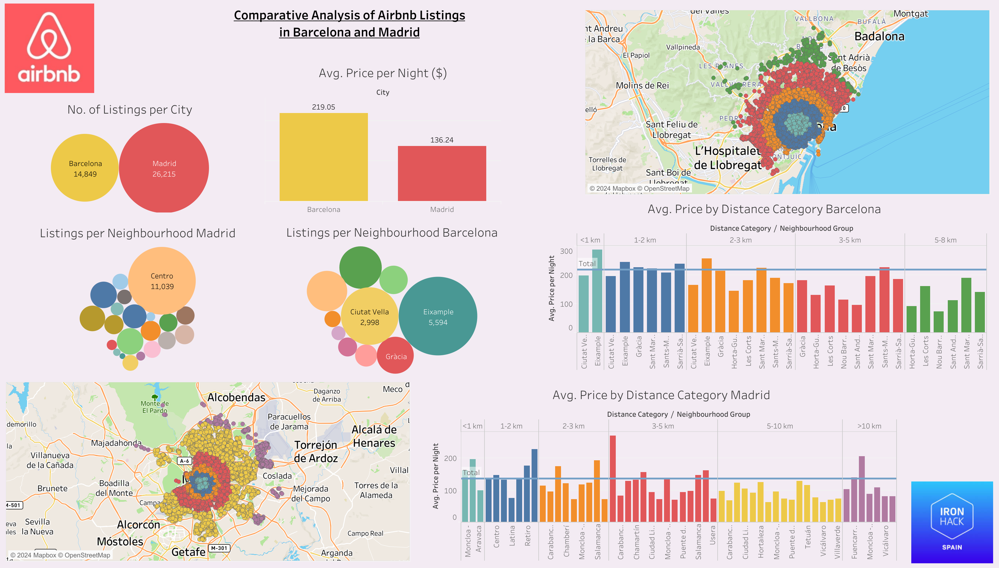

# Business Case: Analysis and Recommendation for Rental Users in Madrid and Barcelona

### Background and Purpose of the Investigation

Barcelona and Madrid are two of the major European tourist hubs, attracting millions of visitors annually. Barcelona alone recorded over 6 million visitors in the most recent year, marking a 5.7% increase from 2023, with an average of 229,531 visitors per day. This compares to 178,289 daily visitors the previous year, as per official data from the Barcelona City Council. Madrid, although receiving fewer tourists, still welcomed an impactful 4.4 million visitors so far this year, according to the Madrid City Council.

This influx of tourists has led to growing discontent among residents in both cities, particularly in central neighborhoods. Locals perceive the surge in tourism as a burden, contributing to rising housing costs, increased shop prices, and congested streets. Much of this frustration is directed at platforms like Airbnb, which are seen as exacerbating the problem.

**Purpose of the Analysis:**
The purpose of this investigation is to provide insights and recommendations for managing rental markets and tourism in Barcelona and Madrid. Specifically, it aims to propose strategies for decentralizing tourism in Barcelona, shifting the focus away from overcrowded hotspots, and to compare the rental dynamics between Barcelona and Madrid to inform better policy decisions, taking into account that tourists stay for an average of 4.6 nights in short-term accommodations.

# Steps

## 0. Data Preparation
The initial dataset extracted from airbnb oficial website contains numerous columns that are not necessary for our analysis. To streamline and focus the exploratory and comparative analysis between the datasets of Barcelona and Madrid, it is crucial to simplify the datasets by removing irrelevant columns. This process will help concentrate on variables that add real value to the analysis and improve its efficiency. Below are the names of the reduced datasets created for this purpose:

- `listing_prepared_bcn`
- `listing_prepared_mad`

## 1. Data Cleaning
Despite the first preparation dataset, a cleaning process in listing_prepared_bcn & listing_prepared_mad must be taken before analysing and modeling. It's essential to ensure our dataset is clean and ready. It is necessary to encoded categorical data and normalised features such as latitude, longitude, price, and amenities (e.g., bedrooms, AC, bathroom, balcony, etc.).

The different processes for cleaning data are described below:

### 1.1 Encoding Categorical Data
Convert categorical variables such as `...`, `...`, and `...` into numerical values using techniques like one-hot encoding or label encoding.

### 1.2 Normalising Data
Standardise features such as price and distance from the city centre to have a mean of zero and a standard deviation of one. This is especially important for calculations involving distance and price.

### 1.3 Calculating Distance
Calculate the distance of each listing from the city centers using the Haversine formula. This can be done in Python. 

## 2. Exploratory Data Analysis (EDA)
Once the dataset has been cleaned, it is crucial to explore the data to understand data structure, uncover patterns and trends, and prepare data for modeling. It helps identify relationships, detect anomalies, and guide decisions through visualisations and statistical insights. EDA supports informed, data-driven decision-making.

### 2.1 EDA for Barcelona
Conduct exploratory data analysis specifically for the Barcelona dataset.

Barcelona offers apartments with an average price of 195 EUR/night. It is noticeable that most apartments receive reviews, which can directly influence the price. Additionally, being a super-host can increase the price by 10%. Barcelona has 18,85 , with 14,848 short-term rentals distributed across 10 neighborhoods, each with different average prices depending on their location and status.

The price also varies based on the type of accommodation, whether it is a full apartment, a private room, or a shared room.

### 2.2 EDA for Madrid
Conduct exploratory data analysis specifically for the Madrid dataset.

Madrid offers apartments with an average price of 136 EUR/night. It is noticeable that most apartments receive reviews, which can subtly influence the price. Additionally, being a super-host increases the price by just 2%. Madrid has 26,868 apartments, with 26,215 short-term rentals distributed across more than 20 neighborhoods, each with different average prices depending on their location and status.

The price also varies based on the type of accommodation, whether it is a full apartment, a private room, or a shared room.

## 3. Analysis
Compare the findings from the EDA of Barcelona and Madrid to identify similarities, differences, and potential recommendations for rental users and policy suggestions.

### 3.1.Airbnb Price Analysis: Barcelona vs. Madrid

As mentioned at the beginning, the purpose of this project is to analyse and compare Airbnb prices in the cities of Barcelona and Madrid for short-term rentals.

##### ANALYSIS

Overall, Barcelona has a total of 18,857 listings, while Madrid has 26,868. Focusing only on short-term rentals, Barcelona has 14,848 listings with an average price of €219.05 per night, while Madrid offers 26,215 listings with a median price of €136.24 per night. This difference is also noticeable when analyzing the features offered for that price :

**Room Type and Price Relationship:**

- **Barcelona:**
  - Shared Room: €117.50/night (median).
  - Private Room or Hotel: €131.52/night (median).
  - Entire Apartment: €239.91/night (median).

- **Madrid:**
  - Shared Room: €105.09/night (median).
  - Private Room or Hotel: €89.29/night (median).
  - Entire Apartment: €162.74/night (median).

Although the platform covers accommodations in all neighborhoods of both cities, in Barcelona, the majority are concentrated in the Eixample and Ciutat Vella neighborhoods, with 5,594 and 2,998 listings, respectively. In contrast, in Madrid, most of the listings (11,039) are located in the city center.

**Price Difference:**

The price is close to the mean and decreases as it gets farther from the hotspot. However, the average price behaviour varies significantly between high-end neighborhoods.

**Price Charts:**

- **Barcelona:**
  - Sant Gervasi is a high-end neighborhood, while L'Eixample has high demand due to its central location.

- **Madrid:**
  - Carabanchel, known as an artists' neighborhood and ranked as the third-best neighborhood in the world by Time Out magazine.
  - El Retiro and Salamanca neighborhoods, both considered high-end areas.

**Bedroom type:**

As the graphic reflects, in general there is a greater percentage of whole apartments offered in both cities, followed by private rooms and lastly shared rooms. Nevertheless Madrid has many more listings than Barcelona.

**Category Status:**

The chart illustrates that the accommodation options are evenly distributed across different budget categories: luxury, economic, and low-cost. Each category comprises approximately 30% of the total offerings, indicating a balanced distribution of accommodations catering to various budget levels.

**Line Chart:**

The line chart depicts the price behavior in Barcelona and Madrid relative to their distance from key hotspots. The general trend shows a positive correlation: as accommodations get closer to the hotspot, the price tends to increase. However, there are occasional price spikes influenced by specific neighborhoods. These anomalies suggest that neighborhood characteristics also play a significant role in pricing.

#### **Conclusions:**

- **Tourism and Accommodation:** Madrid receives fewer tourists than Barcelona but offers a greater number of accommodations. Based on 2024 data, Madrid attracts 30% fewer tourists but has 42% more listings. When focusing solely on short-term rentals, this difference grows to 44%, likely due to varying rental regulations between the cities.

- **Proximity to Key Points:** Proximity to major attractions, such as Plaça Catalunya in Barcelona and Puerta del Sol in Madrid, is a crucial factor in determining accommodation prices. Despite this, other factors like neighborhood ratings, tranquility, and prestige also significantly impact prices. For example, Salamanca in Madrid and Gracia in Barcelona show high prices despite being farther from the city center.

- **Future Study Recommendations:** To better anticipate fluctuations in short-term rental prices, future studies should incorporate additional variables, such as local store types and population density. This would enhance recommendations for tourists seeking accommodation in both cities.

- **Overall Observations:** Madrid appears to be a more economical choice compared to Barcelona, offering more accommodation options. Both cities, however, provide a range of options to cater to different budget levels.

## 3.2.Airbnb Price Prediction for Barcelona and Madrid

**Analysis Overview**

Given the growing demand for short-term rentals, there's a need to analyze and predict rental prices. This project offers a comprehensive analysis that helps set expectations for visitors.

### Regression Models

To predict the prices, we developed two types of regression models:
- **Linear Regression Model**
- **Random Forest Model**

These models were chosen to compare the effectiveness of linear versus non-linear approaches in predicting rental prices.

### Data Preprocessing

Before building the models, we performed the following preprocessing steps:
- **Outlier Removal**: Outliers were identified and eliminated using the z-score calculation \(\frac{X-\mu}{\sigma}\).
- **Normalisation**: Numeric columns were normalised using `StandardScaler`.
- **Clustering with DBSCAN**: We used DBSCAN for clustering, which was also useful in identifying and handling outliers and clustering data with arbitrary shapes.

### Features Used for Prediction

The following variables were selected as features (X) for the models:
- `distance_from_city_center`
- `host_is_superhost`
- `elevator`
- `air_conditioning`
- `room_type_encoded`
- `number_of_reviews`
- `review_scores_rating`

## Results

### Linear Regression Model

**Model Accuracy:**
- **Barcelona Model R² (Training):** 0.227
- **Barcelona Model R² (Testing):** 0.242
- **Madrid Model R² (Training):** 0.268
- **Madrid Model R² (Testing):** 0.257
- **Barcelona Model MSE (Testing):** 0.805
- **Madrid Model MSE (Testing):** 0.736

**Coefficients for Barcelona:**
- `distance_from_city_center`: -0.17
- `host_is_superhost`: -0.00
- `kitchen`: -0.22
- `patio or balcony`: -0.02
- `elevator`: 0.20
- `air_conditioning`: 0.21
- `room_type_encoded`: 0.27
- `bedrooms_encoded`: 0.49
- `number_of_reviews`: 0.01
- `review_scores_rating`: 0.01
- `cluster`: -0.00
- **Intercept:** -0.66

**Coefficients for Madrid:**
- `distance_from_city_center`: -0.17
- `host_is_superhost`: 0.06
- `kitchen`: -0.23
- `patio or balcony`: 0.13
- `elevator`: 0.17
- `air_conditioning`: 0.19
- `room_type_encoded`: 0.39
- `bedrooms_encoded`: 0.69
- `number_of_reviews`: -0.08
- `review_scores_rating`: -0.03
- `cluster`: -0.00
- **Intercept:** -0.85

### Random Forest Model

**Model Accuracy:**
- **Barcelona Model R² (Training):** 0.899
- **Barcelona Model R² (Testing):** 0.339
- **Madrid Model R² (Training):** 0.902
- **Madrid Model R² (Testing):** 0.277
- **Barcelona Model MSE (Testing):** 0.748
- **Madrid Model MSE (Testing):** 0.735

## Conclusions

The selected independent variables (X) are not well-adjusted to predict the dependent variable (Y), as evidenced by the R² scores being below 30% in both models. However, the linear regression model shows a smaller difference between training and testing R², indicating more stability compared to the random forest model, which shows a significant difference between training data and testing data accuracy.

### Key Observations:

- **Distance from City Center:** Negatively impacts price in both cities, emphasizing the premium on central locations.
- **Superhost Status:** Minimal impact on price, slightly positive in Madrid, negligible in Barcelona.
- **Kitchens:** Interestingly associated with lower prices, suggesting different market segments for properties without kitchens.
- **Bedrooms:** Strongly correlated with higher prices, particularly in Madrid.
- **Reviews and Ratings:** Their impact varies, with an unexpected negative correlation in Madrid.

These results provide valuable insights into the factors influencing Airbnb pricing in Barcelona and Madrid, highlighting both similarities and differences between the two markets.

## GENERAL CONCLUSIONS
- reviews don't affect price 
- proximity to the city centre does not correlate with price
- the valuable selected - `distance_from_city_center`
- `host_is_superhost`
- `elevator`
- `air_conditioning`
- `room_type_encoded`
- `number_of_reviews` does not correlate with price
- `review_scores_rating` does not aid in price prediction. More variables should be taken into account such as seasonal demand, prestige, and trends. We recomend undertaking another analysis in the future to better determine the prediction of the price.
